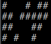
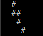
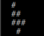

# Conway's Game of Life

## Description
This is a Cellular Automation Method created by **John Conway**.
The “game” is a zero-player game, meaning that its evolution is determined by its initial state, requiring no further input.
One interacts with the Game of Life by creating an initial configuration and observing how it evolves.

## The Rules
1. If a cell is ON and has fewer than two neighbors that are ON, it turns OFF
2. If a cell is ON and has either two or three neighbors that are ON, it remains ON.
3. If a cell is ON and has more than three neighbors that are ON, it turns OFF.
4. If a cell is OFF and has exactly three neighbors that are ON, it turns ON.

## Example
**height** of 4 and **width** of 8:
| *original configuration* | *second configuration* | *third configuration* |
| ------------------------- | ------------------------- | ------------------------- |
|  |  |  |

## Usage
To play this game, clone repository:
``` git clone https://github.com/Sheila-nk/Conways_Game_of_Life.git ```

You can now run the game on your terminal:
``` python conway.py ```

### Enjoy :)
